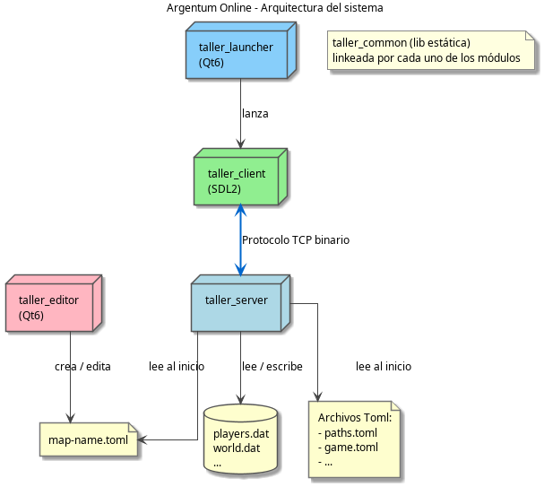
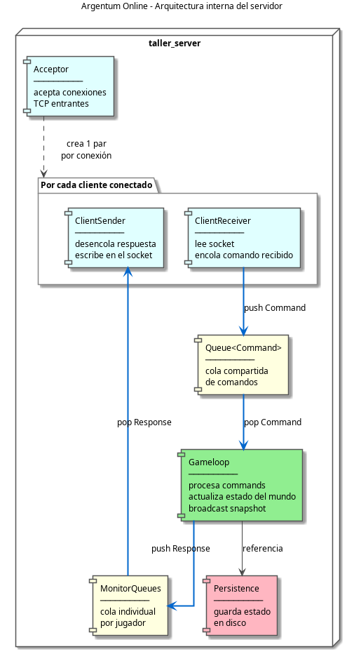
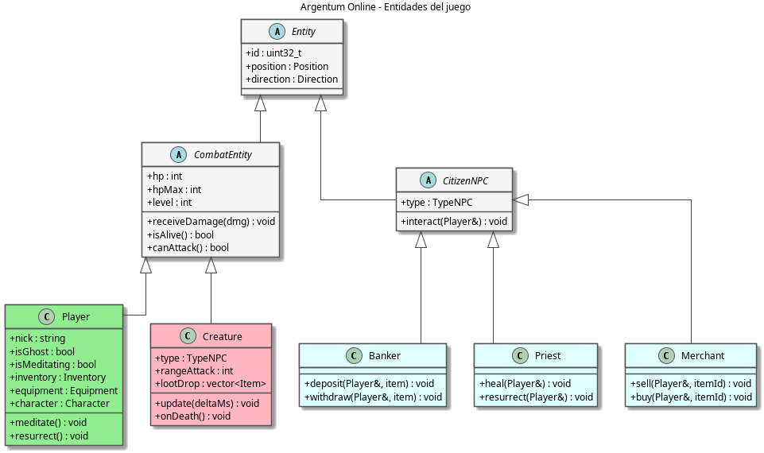
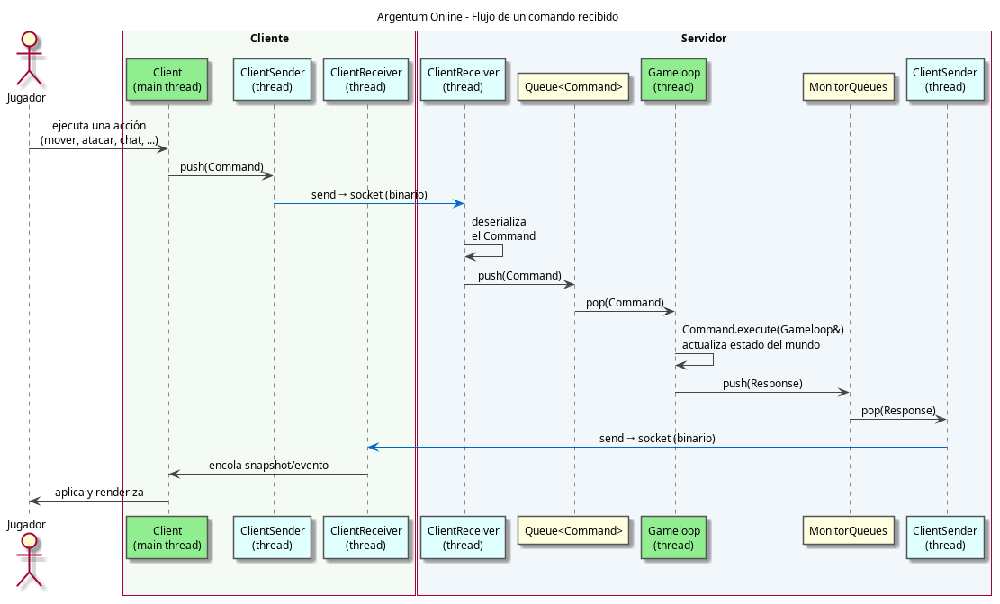
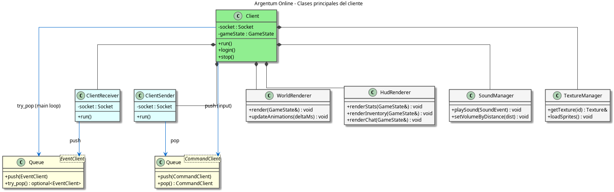

# Argentum Online

## Documentación Técnica

## Taller de Programación I

Primer Cuatrimestre 2026

- Tomas Kopal - 112840
- Facundo Brondo - 97640
- Maryuris Artiles - 110188
- Tomas Apud Mora - 107968

**Materia:** Taller de Programación I (75.42) - FIUBA  

---

## Índice

1. [Visión general](#1-visión-general)
2. [Liberia common](#2-módulo-common)
3. [Servidor](#3-servidor)
4. [Cliente](#4-cliente)
5. [Editor (Qt6)](#5-editor-qt6)
6. [Launcher (Qt6)](#6-launcher-qt6)
7. [Protocolo de comunicación](#7-protocolo-de-comunicación)
8. [Persistencia](#8-persistencia)
9. [Configuración TOML](#9-configuración-toml)

---

## 1. Visión general

Argentum Online es un juego multijugador donde se controla un personaje de rol en un mundo de fantasía. El sistema está compuesto por dos aplicaciones principales **cliente** y **servidor** más una librería compartida. A demas tambien incluye herramientas auxiliares, como un editor de mapas y un launcher grafico.

| Aplicación | Tecnología | Propósito |
|---|---|---|
| `taller_server` | C++20 / POSIX sockets | Lógica y control del estado del juego |
| `taller_client` | SDL2 | Renderizado, audio, input del jugador |
| `taller_editor` | Qt6::Widgets | Creación y edición de mapas (offline) |
| `taller_launcher` | Qt6::Widgets | Login, registro y creación de personaje (opcional) |
| `taller_common` | C++20 (lib estática) | Threading, red, fórmulas, tipos compartidos |

### Arquitectura alto nivel

El servidor es quien tiene el control sobre el estado del juego. El cliente recibe snapshots del mundo y envía acciones del jugador. El editor opera sin necesidad de estar conectado al server y produce archivos toml de mapas que el servidor carga al inicio del lanzamiento.

---



---

## 2. Módulo `common`

**Directorio:** `common/`

`taller_common`: (librería estática)  

Todos los demás módulos linkean la libreria taller_common. Esta provee las abstracciones fundamentales:

### Thread

Clase abstracta que encapsula `std::thread`. Cada subclase implementa `run()`.

```
common/includes/thread.h
```

```cpp
class Thread {
protected:
    virtual void run() = 0;
public:
    void start();
    void join();
};
```

### Queue\<T\>

Cola o BlockingQueue thread-safe. Implementa `pop()` el cual bloquea al consumidor hasta que haya un elemento disponible. Implementa además el método `close()`, al cerrarla, los threads bloqueados en `pop()` se desbloquean y saben que no llegarán más elementos, lo que permite terminar los threads consumidores de forma limpia.

```
common/includes/queue.h
```

Es el mecanismo central de sincronización entre threads en todo el proyecto.

### Socket

Abstracción sobre sockets POSIX. Maneja `send`/`recv` con reintentos y detección de desconexión.

```
common/src/socket.cpp
```

### TomlConfig

Wrapper sobre `tomlplusplus`. Carga un `.toml` y expone acceso tipado con `get<T>(key)` y `get_or<T>(key, default)`.

```
common/src/toml_config.cpp
```

### GameFormulas

Namespace estático con todas las fórmulas del juego. Centraliza los cálculos para que sean fáciles de ajustar desde la configuración.

```
server/includes/game_formulas.h
```

Funciones principales como `calculationMaximunHp`, `calculationMaximunMana`, `calculationDamage`, `calculationDefense`,etc.

### Tipos compartidos

Definidos en `common/includes/`:

- `Position` - coordenadas (x, y) en la grilla del mapa
- `Direction` - enum de 4 direcciones (UP, DOWN, LEFT, RIGHT)
- `Snapshot` - estado del mundo visible para el cliente
- `User` - par (nick, password)
- `CharacterTraits` - raza, clase, apariencia del personaje

---

## 3. Servidor

### 3.1 Arquitectura de threads del servidor

El servidor implementa una serie de threads o hilos que se detallan a continuacion:

- **Acceptor**: escucha el socket del servidor esperando conexiones entrantes. Cada vez que un cliente se conecta, crea un ClientHandler con su propio par de threads (un receiver y un sender) y los registra en el MonitorQueues.

- **ClientReceiver**: lee bytes del socket TCP, los deserializa en un comando concreto (movimiento, ataque, chat, etc.) y lo encola en la cola compartida de comandos. Bloquea esperando datos cuando el socket no tiene actividad.

- **Gameloop**: es el único thread que modifica el estado del juego. En cada tick desencola todos los comandos pendientes y los ejecuta, luego actualiza los npcs, regenera atributos de jugadores y finalmente construye un snapshot del mundo que se envía en `broadcast` a todos los clientes a través del MonitorQueues.

- **ClientSender**: desencola las respuestas de la cola individual del jugador, alimentada por el Gameloop, y las serializa al socket TCP a traves del protocolo. Bloquea cuando no hay respuestas pendientes.

- **Persistence**: corre en paralelo al Gameloop y guarda el estado de los jugadores y el mundo en disco en intervalos configurables.



### 3.2 Secuencia de conexión de un nuevo cliente

Cuando un cliente se conecta, el Acceptor acepta la conexión TCP y crea un ClientHandler con su par de threads (receiver y sender). 

El ClientReceiver queda bloqueado esperando datos del socket mientras el ClientSender espera respuestas en su cola. 

El primer mensaje que llega es el comando de login: el ClientReceiver lo deserializa y lo encola en la cola compartida de comandos. El Gameloop lo procesa, valida las credenciales, agrega al jugador al mundo y responde con un mensaje de login exitoso (o de error) que viaja de vuelta por el ClientSender al socket.

### 3.3 Entidades

Todas las entidades o players del juego heredan de Entity, que provee id, posición y dirección. A partir de esta se tienen dos subclases mas. Una para aquellos jugadores que tienen algun tipo de ataque y los que no.

- **Player** es la entidad principal y con mayor complejidad. Esta tiene inventario, equipamiento, raza y clase, y puede encontrarse en un estado de meditar o fantasma cuando muere.

- **Creature** es un NPC hostil con una implementacion de IA simple: busca al jugador más cercano en su rango, se acerca y ataca. Al morir dropea algun tipo de loot.

- **CitizenNPC** agrupa los NPCs no hostiles: el Banker maneja depósitos y retiros de items y oro, el Priest cura y resucita jugadores, y el Merchant compra y vende items.




### 3.4 Gameloop y patrones Command/Response

El Gameloop es el thread principal del servidor. Corre en su propio thread a una tasa configurable (por defecto 50 ms por paso).

Usa dos patrones para separar la logica del proceso de comandos recibidos y su respuesta. Por el lado de entrada de comandos, cada acción del jugador se representa como un **Command** con un método `execute(Gameloop&)`. Hay cerca de 35 subclases, una por tipo de acción. Los ClientReceiver crean el comando correcto al deserializar el socket y lo encolan. El Gameloop los ejecuta secuencialmente, garantizando que el estado del juego se modifica desde un único thread.

Por el lado de salida, el resultado de cada acción se representa como una **Response** con un método `execute(ServerProtocol&)`. El Gameloop crea la respuesta y la envía a través del MonitorQueues al ClientSender correspondiente.

Se deja a continuacion el flujo para un comando general.



### 3.5 World

World (`server/includes/world.h`) mantiene el estado del juego. Para esto maneja la matriz de tiles, con sus atributos de caminable, las posiciones de jugadores y NPCs, los items tirados en el suelo y las zonas seguras. Es consultado por el Gameloop para validar movimientos, detectar colisiones y resolver interacciones entre entidades.

### 3.6 Otros modelos de interes

**Inventory y Equipment** son propiedades de Player. Inventory maneja hasta 30 slots de items. Equipment tiene 4 slots fijos: arma, armadura, casco y escudo.

**ClanManager** gestiona clanes: creación, solicitudes de ingreso, aceptación, expulsión y bloqueo. Los miembros del mismo clan no pueden atacarse y reciben bonificaciones de combate cuando están cerca entre sí.

**SpawnManager** respawnea criaturas periódicamente respetando la población máxima por zona. Corre dentro del Gameloop, no es un thread separado.

---

## 4. Cliente

El cliente es la aplicación con la que interactúa el jugador. Construido sobre SDL2 (a través del wrapper libSDL2pp), se encarga de renderizar el mundo, reproducir audio, capturar el input y mantener sincronizada una vista local del estado que envía el servidor. Renderiza lo que el servidor le informa y traduce las acciones del jugador en comandos que viajan al servidor.

La clase `Client` es el punto de entrada y dueña de todos los componentes: posee el socket y el protocolo, las dos colas de comunicación, los dos threads de red, la ventana SDL y los renderers y managers de presentación.



### 4.1 Arquitectura de threads

El cliente reparte el trabajo en tres threads que se comunican exclusivamente a través de colas thread-safe.

- **Main thread**: ejecuta el loop principal del juego. Procesa el input de SDL, consume los eventos que llegan del servidor, actualiza animaciones y renderiza el frame. Es el único thread que toca SDL y la pantalla.

- **ClientReceiver**: lee mensajes del socket TCP, los deserializa en estructuras EventClient y los encola en `events_queue`. Bloquea en `recv()` cuando no hay datos, sin consumir CPU.

- **ClientSender**: desencola los comandos que el main thread produjo en respuesta al input del jugador (movimiento, ataque, chat, uso de items, etc.) desde `cmd_queue` y los serializa al socket. Bloquea cuando no hay comandos pendientes.

### 4.2 Loop principal de juego

El método `launch()` arranca los threads de red y entra en el bucle que corre hasta que el jugador cierra el juego. Si el receiver o el sender mueren, el loop termina de forma limpia. Cada iteración del frame realiza los siguientes pasos en orden:

1. Calcula el delta time desde el frame anterior, usado para animaciones independientes de la tasa de frames.
2. Aplica el estado del servidor: desencola todos los eventos pendientes de `events_queue` y, según su tipo, actualiza el mundo renderizable, los stats del HUD, el inventario, el equipamiento, el chat o abre el panel de comerciante/banco.
3. Procesa el input: eventos de teclado y mouse, escritura en el chat, clicks sobre entidades o slots de inventario.
4. Procesa el movimiento sostenido (teclas direccionales mantenidas) generando comandos de movimiento a un ritmo controlado.
5. Actualiza animaciones de sprites y efectos visuales con el delta time de cada layer.
6. Renderiza el frame completo.

### 4.3 Comunicación con el servidor

`ClientProtocol` envuelve el socket y ofrece un método por cada acción que el cliente puede enviar (login, movimiento, ataque, chat, usar/soltar item, equipar, interactuar con NPCs, comprar/vender, depositar/retirar del banco, resucitar, etc.) y un `receiveMessage()` que deserializa el mensaje entrante en un EventClient.

En la entrada, lo que llega del servidor se representa como un EventClient con un campo de tipo que indica qué información trae: una actualización del mundo (snapshot), los stats propios, datos del mapa, actualizaciones de inventario o equipamiento, mensajes de chat, apertura del comercio o del banco, o una desconexión. El main thread despacha cada evento según su tipo.

En el sentido de salida, cada acción del jugador se modela como un ClientCommand (movimiento, ataque, chat, equipar, desequipar). El main thread crea el comando concreto al interpretar el input y lo encola en `cmd_queue`; el ClientSender lo serializa al socket. La fase de login es la excepción: ocurre de forma sincrónica antes de arrancar el loop, intercambiando credenciales y recibiendo el mapa y el inventario inicial.

### 4.4 Renderizado y componentes de presentación

El **WorldRenderer** es el componente central de dibujo. Mantiene la vista local del mundo, un conjunto de entidades renderizables indexadas por id, el mapa actual, los efectos visuales activos y la cámara centrada en el jugador. Aplica cada snapshot reconciliando las entidades que llegan (jugadores, NPCs, items en el suelo) con las que ya tenía, y descarta las que dejaron de aparecer. Al renderizar respeta el orden de las capas del mapa y ordena las entidades por profundidad para que se superpongan correctamente.

El **HudRenderer** dibuja la interfaz superpuesta al mundo: los atributos del jugador (vida, maná, nivel, oro, experiencia), el inventario, el equipamiento y la consola de chat.

El **ChatManager** administra el estado del chat del lado del cliente: el buffer de texto que el jugador está escribiendo, el historial de mensajes y el parseo de los mensajes que llegan del servidor para clasificarlos en públicos, susurros o de sistema.

El **TextureManager** funciona como cache de texturas SDL2, cargando los sprites una sola vez y reutilizándolos. El **FontManager** cumple el mismo rol para las fuentes de texto. El **SoundManager** reproduce efectos de sonido y música de fondo, atenuando el volumen según la distancia al evento.

---

## 5. Editor (Qt6)

El editor es una herramienta offline que produce archivos `map-name.toml` que el servidor carga al iniciar. No requiere conexión con ninguna otra aplicación. La interfaz está construida sobre Qt6 y Widgets con una escena editable (MapScene/MapView) representada por una grilla de tiles.

### Modelo del mapa

El mapa está representado por la clase Map (`common/includes/map/map.h`), el cual es matriz de tiles organizada en 4 layers apiladas:

| Layer | Nombre | Uso típico |
|---|---|---|
| 0 | Background | Suelo base (césped, agua, piedra) |
| 1 | Details | Detalles sobre el suelo (caminos, flores) |
| 2 | Object | Objetos y estructuras (árboles, paredes, edificios) |
| 3 | Roof | Techos que se dibujan sobre todo lo demás |

Cada tile almacena un `sprite_id` que referencia la imagen a dibujar y un flag `walkable` que indica si los jugadores pueden pisar esa celda. El walkable se configura por tile, no por layer, y es lo que el servidor usa para validar movimientos.

Los tiles son de 32×32 px. Los sprites pueden ocupar más de un tile y el editor tiene en cuenta el tamaño real del sprite al mostrarlo sobre la grilla.

El editor cuenta con una paleta de sprites (TileWidget) donde se pueden tomar diferentes imagenes para crear el mundo.

### Acciones disponibles en el editor

- Crear un mapa nuevo o cargar uno existente
- Seleccionar la layer activa y pintar tiles eligiendo sprites de la paleta
- Marcar tiles como no caminables (colisiones)
- Definir zonas seguras como ciudades o pueblos
- Definir zonas hostiles con spawn de criaturas como mazmorras, cavernas, etc.
- Guardar el mapa como `map-name.toml` para desplegarlo en el directorio de configuración del servidor
- Acciones varias como zoom in, zoom out, desplazamiento, deshacer, rehacer, etc.

---

## 6. Launcher (Qt6)

El launcher es una interfaz Qt6 opcional (deshabilitada por defecto, se activa con `-DTALLER_LAUNCHER=ON`) que evita tener que pasar argumentos de línea de comandos al cliente.

La ventana principal tiene dos pestañas: login y registro. En la pestaña de login el usuario ingresa host, puerto, usuario y contraseña. En la de registro, además de las credenciales, se recorre un flujo de cuatro pasos para crear el personaje: selección de raza (Humano, Elfo, Enano, Gnomo), selección de clase (Mago, Clérigo, Paladín, Guerrero), y elección de sprites de cabeza y cuerpo según la raza. En cada paso se muestra una previsualización en vivo del personaje combinando ambos sprites.

Una vez confirmado el login o el registro, el launcher invoca al `taller_client` como subprocess pasándole las credenciales y la selección de personaje como argumentos. Si el servidor responde correctamente, lanza el cliente en modo juego y se cierra. El launcher no abre ninguna conexión TCP directa: toda la comunicación con el servidor pasa por el cliente. El timeout para cada operación de red es de 5 segundos.

Las tres clases principales son LoginWindow, que maneja la ventana principal con las dos pestañas; SignupWindow, que implementa el flujo de creación de personaje; y CharacterWindow, que es un stub reservado para una futura pantalla de selección de personaje post-login.

---

## 7. Protocolo de comunicación

**TODO:** Linkear a docu de protocolo
---

## 8. Persistencia

El estado del juego se guarda en archivos binarios con structs de tamaño fijo.

Los datos de jugadores se almacenan en `players.dat`, con un índice separado `players.idx` que mapea nick a offset en el archivo. El índice vive en memoria y se reconstruye al iniciar, lo que hace las búsquedas O(1).

El estado del mundo (criaturas activas, items en suelo, tesoros) se guarda en `world.dat` y se recarga al iniciar, permitiendo preservar el estado entre reinicios.

Los clanes se persisten en un archivo separado gestionado directamente por el ClanManager a través de sus métodos `save()` y `load()`. Se guardan el nombre del clan, el fundador, los miembros activos, las solicitudes pendientes y los miembros bloqueados. El archivo se carga al iniciar el servidor y se guarda ante cualquier cambio en la estructura del clan.

El thread Persistence guarda periódicamente (intervalo configurable en TOML) y también al shutdown limpio del servidor.

---

## 9. Configuración TOML

Toda la configuración del servidor vive en `server/config/`. El punto de entrada es `paths.toml`, que referencia al resto de los archivos de configuración. Los mapas se guardan por separado en el subdirectorio `data/`.

**Archivos de configuración:**

| Archivo | Contenido |
|---|---|
| `paths.toml` | Punto de entrada; rutas al resto de archivos de config y datos |
| `game.toml` | Estado inicial del jugador (nivel, oro, slots de inventario), parámetros del servidor y del clan |
| `races.toml` | Definición de razas (Humano, Elfo, Enano, Gnomo): factores de vida, maná y recuperación |
| `clases.toml` | Definición de clases (Mago, Clérigo, Paladín, Guerrero): factores de vida, maná y meditación |
| `items.toml` | Todos los items del juego: armas, armaduras, pociones - daño, defensa, costo de maná |
| `creatures.toml` | Criaturas hostiles: HP, nivel mínimo/máximo, rango de ataque, loot |
| `npcs.toml` | NPCs ciudadanos: tipo, posición, apariencia |
| `regions.toml` | Regiones del mapa: si son zona segura, máximo de criaturas y tesoros |
| `building.toml` | Detección de edificios: layers y sprite IDs que representan estructuras |

---